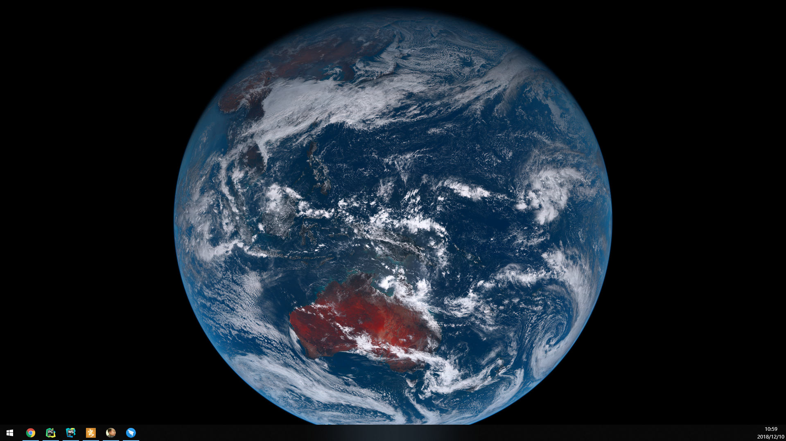

# himawaripy
*Put near-realtime picture of Earth as your desktop background*

himawaripy is a Python 3 script that fetches near-realtime (10 minutes delayed)
picture of Earth as its taken by
[Himawari 8 (ひまわり8号)](https://en.wikipedia.org/wiki/Himawari_8) and sets it
as your desktop background.
